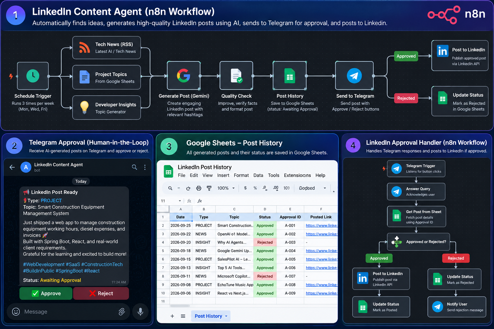

# LinkedIn Content Automation Agent

An AI-powered LinkedIn content automation system built with **n8n, Google Gemini, Google Sheets, Telegram, and JavaScript**.

The system automates LinkedIn content creation, validates generated posts, prevents duplicate topics, stores post history, and sends posts to Telegram for human approval.


## 🚀 Project Overview

The automation supports three main content types:

- **NEWS** — AI and technology news
- **PROJECT** — Build-in-public posts about projects
- **INSIGHT** — Developer and AI engineering insights

The workflow also includes fallback handling when project data is unavailable.

## 🏗️ Workflow Architecture

```text
                    Schedule Trigger
                           |
              +------------+------------+
              |            |            |
             NEWS       PROJECT      INSIGHT
              |            |            |
          RSS Feed     Google Sheet   Topic Bank
              |            |            |
              +------------+------------+
                           |
                    Gemini Generation
                           |
                    Quality Validation
                           |
                  NEWS → Fact Check
                           |
                    Duplicate Check
                           |
                    Post History
                           |
                       Telegram
                           |
                  +--------+--------+
                  |                 |
              ✅ Approve         ❌ Reject
                  |                 |
            Status: Approved   Status: Rejected
✨ Key Features
AI Content Generation

Google Gemini generates LinkedIn posts using the information provided to the workflow.

Content Rotation

The system avoids repeatedly using the same:

News articles
Projects
Insight topics
Fallback topics
Quality Validation

Generated posts are checked for:

Empty output
Post length
Hashtag count
Placeholder text
Suspicious AI-generated text
News Fact Checking

NEWS posts are checked against the source article before being stored.

Duplicate Prevention

Post History is used to avoid previously used topics and projects.

Fallback Handling

When no unused project is available, the workflow automatically selects a topic from the fallback topic bank.

Telegram Approval

Generated posts are sent to Telegram with:

✅ Approve    ❌ Reject

The selected action updates the corresponding Post History record.

Approval ID

Each generated post receives a unique Approval ID so the approval workflow can identify the correct Post History record.

🛠️ Technologies Used
n8n — Workflow automation
Google Gemini — AI content generation
Google Sheets — Data and post history
Telegram Bot API — Human approval
JavaScript — Data processing and validation
RSS/XML — News ingestion
REST APIs — Integrations
Docker — Local n8n environment
📂 Repository Structure
linkedin-content-automation-agent/
│
├── workflows/
├── Linkedin agent (1).json
├── LinkedIn Approval Handler (1).json
├── README.md
└── .gitignore
🔄 Content Flow
NEWS
Google AI RSS Feed
       ↓
XML → JSON
       ↓
Extract Articles
       ↓
Remove Previously Used Articles
       ↓
Select Fresh Article
       ↓
Gemini
       ↓
Quality Check
       ↓
Fact Check
       ↓
Post History
       ↓
Telegram Approval
PROJECT
Google Sheets
       ↓
Compare With Post History
       ↓
Select Unused Project
       ↓
Gemini
       ↓
Quality Check
       ↓
Post History
       ↓
Telegram Approval
PROJECT Fallback
No Unused Project
       ↓
Fallback Topic Bank
       ↓
Remove Used Topics
       ↓
Select Topic
       ↓
Gemini
       ↓
Quality Check
       ↓
Post History
       ↓
Telegram Approval
INSIGHT
Insight Topic Bank
       ↓
Remove Previously Used Topics
       ↓
Select Fresh Topic
       ↓
Gemini
       ↓
Quality Check
       ↓
Post History
       ↓
Telegram Approval
📊 Post History

Google Sheets is used as the lightweight data layer.

The Post History tracks:

Date
Type
Project
Topic
Angle
Post
Status
LinkedIn URL
Approval ID

Possible statuses include:

Awaiting Approval
Approved
Rejected
🔐 Security

Do not commit sensitive information to this repository.

Never upload:

API keys
Telegram bot tokens
OAuth client secrets
OAuth access or refresh tokens
Passwords
SSH private keys
.env files
n8n database files

Credentials should be configured inside n8n rather than stored in GitHub.

🧪 Current Project Status
Completed
 NEWS automation
 PROJECT automation
 INSIGHT automation
 Project rotation
 News rotation
 Insight rotation
 Fallback topic system
 AI content generation
 Quality validation
 NEWS fact checking
 Duplicate prevention
 Post History
 Telegram notifications
 Telegram Approve/Reject buttons
 Approval Handler
 Approval ID based routing
 Approved/Rejected status updates
Planned
 Direct LinkedIn API publishing
 Production cloud deployment
 24/7 deployment
 Production monitoring and error notifications
🎯 Learning Outcomes

This project demonstrates practical experience with:

Workflow automation
AI integration
API integration
Conditional logic
Data validation
Fallback and error handling
Duplicate prevention
Human-in-the-loop automation
Webhooks
Google Sheets data management
Docker-based development
📌 Why I Built This

Instead of building a simple AI text generator, I wanted to build a complete automation workflow that handles the surrounding problems:

data → generation → validation → history → approval → publishing

The main goal is to make AI automation more reliable and structured.

👨‍💻 Author

Built as a personal project to explore n8n, AI automation, workflow design, APIs, and human-in-the-loop systems.

